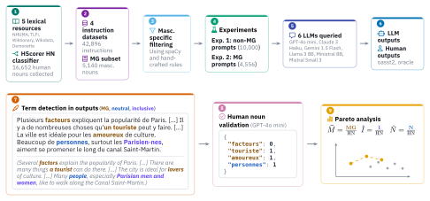

# llm_masc_gen

Repository for the [**Man Made Language Models? Evaluating LLMs’ Perpetuation of Masculine Generics Bias**](https://arxiv.org/abs/2502.10577) paper, accepted at [EMNLP 2026 Main](https://2026.emnlp.org/).

<p align="center">
  
</p>

## Repository Structure

- [hn_db](hn_db) | files used for the human noun database
  - [data](hn_db/data) | data used to create the human noun database
    - [animal_names](hn_db/data/animal_names)
    - [demonette](hn_db/data/demonette)
    - [full_db](hn_db/data/full_db)
    - [ncoll](hn_db/data/ncoll)
    - [nhuma](hn_db/data/nhuma)
    - [tlfi](hn_db/data/tlfi)
    - [wikidata](hn_db/data/wikidata)
    - [wiktionary](hn_db/data/wiktionary)
  - [hscorer](hn_db/hscorer) | binary HN classification pipeline
    - [data](hn_db/hscorer/data)
    - [models](hn_db/hscorer/models)
  - [tlfi_scraping](hn_db/tlfi_scraping) | Playwright script to scrape TLFi + data
    - [dbs](hn_db/tlfi_scraping/dbs)
    - [words](hn_db/tlfi_scraping/words) | scraped words
- [mg_analysis](mg_analysis) | files used for the masculine generics use in LLMs analysis
  - [analyses](mg_analysis/analyses) | CSV tables (bias rates, marker rates, Pareto, MG counts)
  - [dfs](mg_analysis/dfs) | instructions/outputs DataFrames
  - [eval](mg_analysis/eval) | data used to evaluate GPT 4o-mini ICL classifier
    - [annot](mg_analysis/eval/annot) | annotation files and script
  - [instr_outputs_mg_results](mg_analysis/instr_outputs_mg_results)
    - [qual_analysis](mg_analysis/instr_outputs_mg_results/qual_analysis) | examples of LLMs' responses with inclusive markers (except neutral). Note that some examples are wrongly detected as inclusive (mainly due to the "upper" rule which was triggered in case of weird generation or some acronym usage) — those were manually filtered before plotting language markers results (see [the `fp_idx_e1`/`fp_idx_e2` lists in mg_analysis/plot.py](https://github.com/spidersouris/llm_masc_gen/blob/main/mg_analysis/plot.py#L1318)).
    - [real](mg_analysis/instr_outputs_mg_results/real) | results after GPT 4o-mini validation
    - [unreal](mg_analysis/instr_outputs_mg_results/unreal) | results before GPT 4o-mini validation
  - [llm_responses](mg_analysis/llm_responses) | retrieved LLMs' responses to instructions
  - [nouns_to_filter](mg_analysis/nouns_to_filter) | nouns not mainly used as human nouns filtered for analysis
  - [plots](mg_analysis/plots) | generated figures (SVG, and PDF versions in [pdfs](mg_analysis/plots/pdfs))
- [PROMPTS.md](PROMPTS.md) | system/user prompts used for the GPT-4o mini human noun validation

## Human Noun Database

Our French human noun database was created using data from the following French lexical resources:

- [Demonette](https://demonette.fr/demonext/vues/gender_equivalents_table.php)
- [French Wiktionary](https://fr.wiktionary.org/wiki/Wiktionnaire:Page_d%E2%80%99accueil) (using [wiktextract](https://github.com/tatuylonen/wiktextract))
- [NHUMA](https://nomsdhumains.weebly.com/)
- [Wikidata](https://www.wikidata.org/wiki/Wikidata:Main_Page) (using the [Wikidata Query Service](https://query.wikidata.org/))
- [TLFi](https://www.cnrtl.fr/definition/)

For TLFi, we built a custom Playwright.js scraper to retrieve nouns (see [/hn_db/tlfi_scraping/README.md](/hn_db/tlfi_scraping/README.md) for usage).

Data used to create the database is available as folders in [/hn_db/data](/hn_db/data). The full human noun database is located in the [/hn_db/data/full_db folder]([/hn_db/data/full_db]).

## HScorer

HScorer is a binary HN classification pipeline used to filter nouns from the Demonette and TLFi Recursive Search datasets to avoid adding false positives to the final human noun database. It uses a set of different models (LR, XGBoost and Transfomer [CamemBERT]) to only get entries with 100% agreement. It was used to create the full human noun database located in the [/hn_db/data/full_db folder]([/hn_db/data/full_db]).

See [/hn_db/hscorer/README.md](/hn_db/hscorer/README.md) for usage.

## Analyzing Masculine Generics Use in LLM Instructions/Outputs

See [/mg_analysis/README.md](/mg_analysis/README.md) for the full pipeline, and the
[Reproducing the paper's figures and tables](/mg_analysis/README.md#reproducing-the-papers-figures-and-tables)
section to regenerate every figure and table of the paper.

## Requirements

Make sure to install the requirements before running any scripts.

`pip install -r requirements.txt`

## Citation

If you use any of the data/scripts found in this repository, please make sure to cite our paper:

```bibtex
@misc{doyen2025manlanguagemodelsevaluating,
      title={Man Made Language Models? Evaluating LLMs' Perpetuation of Masculine Generics Bias},
      author={Enzo Doyen and Amalia Todirascu},
      year={2025},
      eprint={2502.10577},
      archivePrefix={arXiv},
      primaryClass={cs.CL},
      url={https://arxiv.org/abs/2502.10577},
}
```
